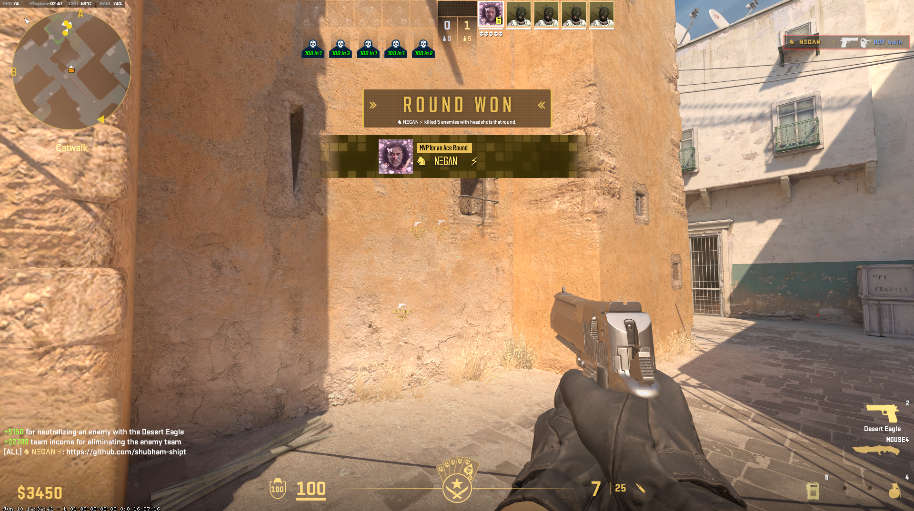

<h1 align="center">
  🎯 CS2 MVP Auto Chat Tool — Kali Linux Edition
</h1>

<p align="center">
  <br>
  <strong style="font-size: 1.5rem;">♞ NΞGΛN ⚡</strong>
</p>

<p align="center">
  🔒 No aim assist. No wallhack. Just clean MVP recognition + chat automation using In game console.
</p>

<p align="center">
  
  
  
  
  
  
</p>

---

## 🧩 What This Tool Does (Simple Definition)

✨ **CS2 MVP Auto Chat Tool** auto-types your message (like GitHub link) into CS2 chat *only when you become MVP*.  
❌ No cheating. No memory writing. No aim or ESP.

✔️ When you're MVP:
- Game freezes your agent briefly  
- Tool auto types your message  
- Looks 100% human (not bot-like)

🎯 Purpose = show  your 
 messages in loop 

*naturally** in casual/private games

---

## 🧠 Features Breakdown

| 🎮 Feature | 🔍 Description |
|-----------|----------------|
| 🥇 **Auto MVP Detection** | Detects when you’re MVP  |
| ⌨️ **Auto Chat Typing** | Types your custom message in CS2 team chat |
| 🧠 **Non-Sus Trigger** | Agent freezes momentarily for realistic typing |
| ⚙️ **Customizable** | Edit your message, delay, triggers |
| 🐧 **Linux Native** | Works on Kali Linux (amd64 only) |
| 🔒 **VAC Safe (External)** | No DLL, no injection, no write to memory |
| 🧱 **Modular Build** | Windows version come soon|

---

## 💻 Technologies Used

| 🧩 Component | 🔧 Role |
|-------------|--------|
| C++ / g++ | Core logic and memory scanner |
| X11/XTest | Keyboard input simulation |
| procfs | Linux memory reader for CS2 |
| Cheat Engine | Testing MVP offsets (Windows only) |
| Makefile | Build system for Linux |

---

## 📦 System Requirements

| Component | Minimum Spec |
|----------|--------------|
| OS | Kali Linux 2023+ |
| Arch | amd64 |
| RAM | 16 GB |
| CPU | Intel i5 12th Gen or higher |
| Game | CS2 (Steam) |
| Desktop | X11 only (Wayland not supported) |

---
---

## 🖼️ Screenshots

| In-Game MVP Freeze |
|--------------------|
|  |

---

## ⚙️ Installation

### 1️⃣ Clone the Repo
```bash
git clone https://github.com/shubham-shipt/cs2-mvp-autochat
cd cs2-mvp-autochat
```

### 2️⃣ Build the Tool
```bash
make
```

### 3️⃣ Run Before or During Game
```bash
sudo ./Cs2(Main).cpp
```
✅ Best when CS2 is already running.

### ✍️ Customize Message
Edit this line in the source code:

```cpp
const std::string MVP_MESSAGE = "https://github.com/shubham-shipt";
```

Keep it short & clean.

---

## 🔍 How It Works
```bash
1. Scans for CS2 process ID
2. Monitors memory flag for MVP status
3. When MVP → Simulates keypress to type your message
4. Auto ENTER to send
```
During MVP animation, agent freezes → makes it look human.

---

## ❌ What This Tool Does NOT Do

❌ No Aimbot  
❌ No Wallhack  
❌ No ESP or Triggerbot  
❌ No DLL injection or game patching  
✅ Just reads memory externally & types naturally

---

## ⚠️ VAC Warning

This is an external tool and does **not inject** into CS2.  
But never use in ranked or comp. Use only in:

- Casual  
- Workshop  
- Private servers

```diff
- Use of internal cheat engines will lead to a ban.
+ This tool is safe because it doesn’t inject or write memory.
```


## 🔮 Coming Soon (For Windows)

- ✅ MVP Detection  
- ✅ Auto Typing in CS2 Chat  
- 🧠 Offset Dumper (Auto) – Automatically fetch memory offsets  
- 🪟 **Windows Version (.exe)**  
  - Built with: `C++`, `WinAPI`, `ReadProcessMemory()`  
  - No driver, no kernel access  
  - Works on: Windows 10/11  
  - Hotkey-based UI, Dark mode  
  - Supports CS2 (Source 2 Engine)  
- 🧰 GUI Editor  
  - Modify message, delay, font size  
  - Preview before use  
- 🎨 Theme / Hotkey toggle  
  - Light/Dark console themes  
  - Set activation/deactivation keys  
 

---

## 👨‍💻 Developer

**Shubham Singh**  
Web Dev | Cybersecurity Enthusiast | Gamer  
🔗 [github.com/shubham-shipt](https://github.com/shubham-shipt)

---

> 💬 “Top fragger
> – ♞ NΞGΛN ⚡
